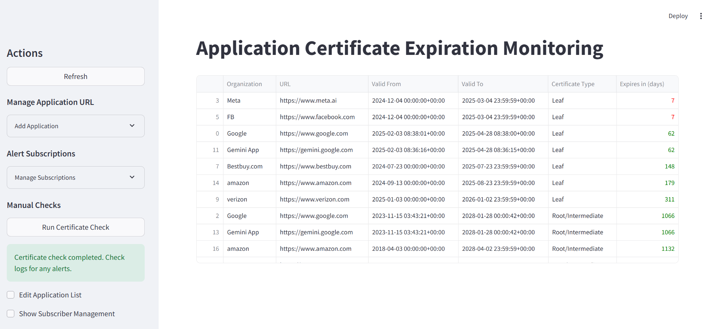

# Application Certificate Expiration Monitoring

[Certificate Monitoring App](https://certificatemonitoringapp.streamlit.app/)

This Streamlit application provides a user-friendly interface for monitoring the expiration dates of application certificates. It allows you to add application URLs, subscribe for email alerts, and view certificate details with expiry warnings.



## Features

* **Add/Manage Applications:** Easily add and manage the URLs of the applications you want to monitor. A basic URL format validation is included.
* **Alert Subscriptions:** Subscribe to receive email notifications when certificates are nearing expiration.
* **Manual Checks:** Manually trigger a certificate check and alert generation.
* **Certificate Overview:** View a table of all certificates, including the organization, URL, subject, validity dates, and days until expiry. Expiry warnings are visually highlighted.
* **Subscriber Management:** (Optional) Manage subscriber email addresses through an interactive table. Add, update or delete subscriber emails.
* **Application Management:** (Optional) Manage application details through an interactive table. Update application names and URLs.
* **Responsive Design:** The layout adapts to different screen sizes for optimal viewing.

## Getting Started

### Prerequisites

* Python 3.7+
* Streamlit
* requests
* schedule
* pandas

### Installation and Setup

1. Clone the repository:

```bash
git clone [https://github.com/lopesrohan1988/CertificateMonitoringApp.git]
cd CertificateMonitoringApp

#Create a virtual environment (recommended):
python3 -m venv venv
source venv/bin/activate  # On Windows: venv\Scripts\activate

#Install the required packages:
pip install -r requirements.txt

#Running the Application

streamlit run app.py

## Running the Certificate Monitoring Scheduler

The `scheduler.py` script is responsible for periodically checking SSL certificates and sending email alerts if any certificates are nearing expiration.


CERTIFICATEMONITORINGAPP/
├── app.py             # Main Streamlit script (orchestration)
├── components/      
│   ├── sidebar.py           
│   ├── app_management.py    
│   ├── subscriber_management.py
│   └── mainpage.py
├── services/         
│   ├── database.py  
│   ├── scheduler.py 
├── setup/            
│   ├── requirements.txt        
│   └── run.bat
├── config/            
│   ├── config.py       
├── testfiles/             
│   ├── test.py
├── cert_monitor.db    
└── README.md